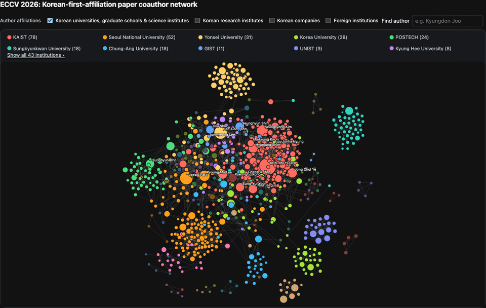

# Paper Atlas

Paper Atlas is a collection of reproducible conference-paper datasets and
interactive maps of authors, institutions, and collaboration.

The first proof of concept is [`pocs/eccv26-korea`](pocs/eccv26-korea/): an
ECCV 2026 main-paper view filtered by first authors with a Korean-affiliated
institution. Its scope is intentionally a filter, not the project boundary.

## Preview

The interactive map supports affiliation filters, author search, connected
coauthor-component focus, institution focus, pan, zoom, and node dragging.

## Planned slices

- `eccv26-korea`: Korean-affiliated first-author ECCV 2026 proof of concept.
- `eccv26-global`: all ECCV 2026 main papers.
- Future conference/year slices for ICCV, CVPR, ICLR, NeurIPS, and others.

Each slice should retain its source snapshot, classification/audit outputs,
generator, and rendered artifact so that its claims can be reviewed and
regenerated independently.
